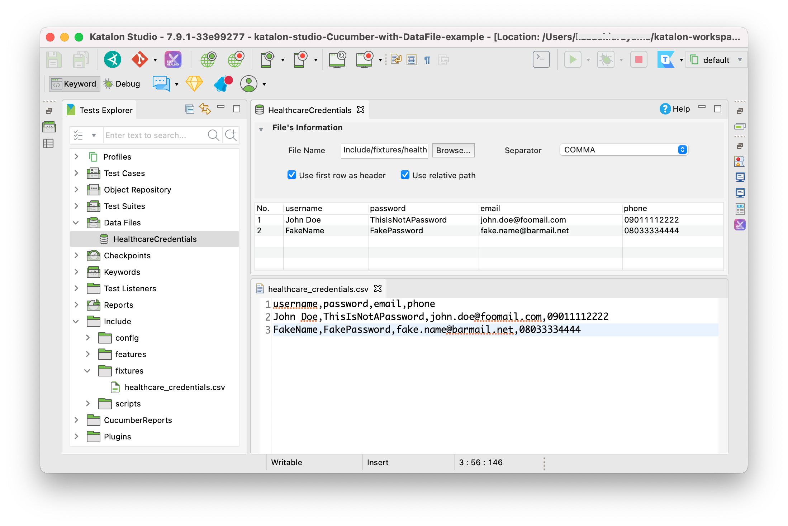

Datafile-backed Cucumber Test Example in Katalon Studio
=====

- author: kazurayam
- date: May, 2021

This is a small [Katalon](https://www.katalon.com/) Studio project for demonstratin purpose.
You can download the zip of this project at the [Releases](https://www.katalon.com/) page, 
unzip and open it with your Katalon Studio.

This project was developed using Katalon Studio v7.9.1 but should work with older versions >= 7.0.

# Problem to solve

A [topic](https://forum.katalon.com/t/pass-common-test-data-in-entire-test-suite/54227/7) in
the Katalon User Forum raised a question to me: *how can I create a Katalon Studio project 
which is Behavior-Driven by Cucumber, and uses an external data file as fixture?*

Katalon Document ["BDD Testing Framework (Cucumber integration)"](https://docs.katalon.com/katalon-studio/docs/cucumber-features-file.html) gives us a good example of Cucumber test in Katalon Studio. I went through it, and found it does not tell us how to utilise external data sources (CSV, Excel, DB) which is described in another document ["Run Test Case with an external data source"](https://docs.katalon.com/katalon-studio/docs/run-test-case-external-data.html). I realised that we need a missing document: **How to run Cucumber Test with an external data source**. 


# Solution

A Cucumber Step Definition in Katalon Studio is essentially an ordinary Groovy script, just like a Katalon Keyword. You can write a Cucumber Step Definition so that it refers to an external data source.

But how? A Step Definition can call any Katalon API including `com.kms.katalon.core.testdata.TestDataFactory.findTestData(String testDataID)`. Therefore it can instanciate an `com.kms.katalon.core.testdata.TestData` object which wraps external data sources such is CSV file, Excel book and a query resultset of DB. 

# Description

I will follow the Cucumber project described in the doc ["BDD Testing Framework (Cucumber integration)"](https://docs.katalon.com/katalon-studio/docs/cucumber-features-file.html) while I will twist and modify it a little bit.

## Import an CSV file to Test Data

I created [a CSV file](Include/fixtures/healthcare_credentials.csv) that contains 2 rows of credentials (username, password, email address, phone number). The username column is supposed to be unique, which will identify each rows. I imported this CSV file to a Test Data named `HealthcareCredentials`. The following picture shows what I have got.




## Write a Cucumber Feature

I created a Cucumber Feature [`CuraLogin.feature`](Include/features/healthcare/CuraLogin.feature). It is 90% similar to the [original](https://docs.katalon.com/katalon-studio/docs/cucumber-features-file.html#add-feature-files) but is different at a critical point. The original has the following code:

```
    ...
    And I enter username <username> and password <password>
    ...
    Examples: 
      | username | password           |
      | John Doe | ThisIsNotAPassword |
```

Please note that the original Feature has the values of `username` and `password` hard-coded in the Feature file.
On the other had my code looks like this:

```
    ...
    And I enter username <username> and will retrieve password from Test Data
    ...
    Examples: 
      | username |
      | John Doe |
```

My Feature gives only `username` value, and it will internally retrieves `password` from the external Test Data `HealthcareCredentials`.


